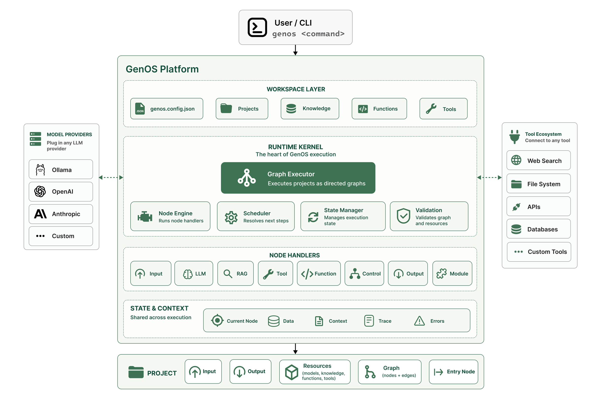

# GenOS

> Build AI workflows as executable graphs.

Composable graph-based AI orchestration runtime by __Sagentic__.

GenOS is a local-first AI orchestration runtime that executes workflows as directed graphs.

Inspired by operating system concepts, GenOS treats AI workflows as executable systems rather than prompt chains, providing a runtime kernel for managing state, knowledge, tools, functions, and model execution.

## Features

- Graph-based workflow execution
- Local-first AI with Ollama
- RAG and knowledge management
- Reusable project composition
- Built-in and custom functions
- Reusable tool integration
- Workspace-based development
- Provider agnostic (Ollama, OpenAI, Anthropic, custom)

## Architecture



*GenOS Runtime Architecture*

## Architecture Overview

GenOS is built around a runtime kernel that executes projects as directed graphs.

A project consists of:

- Inputs and Outputs
- Graph definition
- Resources (models, knowledge, functions, tools)
- Entry node

The runtime kernel manages:

- Graph execution
- State and context
- Node dispatching
- Validation
- Resource resolution

Projects can invoke other projects through Module Nodes, enabling workflow composition and reuse.

# Getting Started

## 1. Install GenOS

```bash
npm install -g @sagentic/genos
```

## 2. Create a Workspace

Create a new GenOS workspace:

```bash
genos workspace create my-genos-workspace
```

Move into the workspace:

```bash
cd my-genos-workspace
```

A workspace contains:

- projects
- knowledgs
- functions
- runtime configuration
- generated artifacts

You can create multiple independent GenOS workspaces anywhere on your system.

## 3. Setup Local AI Runtime

GenOS currently uses __Ollama__ as the default local runtime for language models and embedding models.

Install Ollama:

https://ollama.com/download

Then run the guided setup (use `-d` to accept recommended models without prompting):

```bash
genos setup -d
```

The setup command will (interactive by default). Use `-d, --default` to run non-interactively and accept the recommended models.

- detect Ollama
- prompt to choose supported models (or accept recommended defaults with `-d`)
- pull missing models automatically
- validate model connections
- create the following workspace structure
- configure `genos.config.json`

```
my-genos-workspace/
├─ genos.config.json
├─ projects/
├─ knowledge/
├─ functions/
└─ .genos/
```

Recommended starter models:

- `phi3`
- `mxbai-embed-large`

You can verify your environment anytime using:

```bash
genos doctor
```

## 4. Create Your First Project

Create a basic RAG chatbot project:

```bash
genos project create help-bot
```


## 5. Create a Knowledge Base

Create a knowledge base:

```bash
genos knowledge create help-docs -o
```

This creates:

```text
knowledge/help-docs/help-docs.txt
```

and opens the file.

> Note: `genos embedding create` is deprecated. Use `genos knowledge create` instead.

## 6. Add Your Knowledge

Add any content you want your bot to learn from to this file.

Example:

```text
GenOS is a graph-based AI orchestration runtime.

It supports:
- graph execution
- tools
- functions
- knowledge embeddings
- local-first AI workflows
```


## 7. Build Knowledge

Generate vector embeddings from your documents:

```bash
genos knowledge build help-docs
```

The setup command will:

- let you choose an embedding model from the available models.
- create the vector embeddings on the knowledge using the selected embedding model.

> Note: `genos embedding build` is deprecated. Use `genos knowledge build` instead.

## 8. Attach knowledge to the project

Attach an existing knowledge collection to the project so RAG nodes can use it at runtime. This command registers the knowledge name with the project's configuration — it does not (re)build vector data, so make sure you've already run `genos knowledge build help-docs` if needed.

Use the `-k, --knowledge <name>` flag to specify the collection:

```bash
genos project add help-bot -k help-docs
```

## 9. Configure the Workflow Graph

Open the project config:

```bash
genos project open help-bot   
```

Verify the knowledge is listed and that your RAG node references `knowledge: help-docs`.

Update the graph to connect:

- user input
- knowledge retrieval (RAG)
- language model response
- CLI output

Example:

```yaml
entryNode: start

graph:
  nodes:
    start:
      type: input
      mode: cli
      output: user_input

    search:
      type: rag
      model: mxbai-embed-large
      knowledge: help-docs
      input: user_input
      output: context

    answer:
      type: llm
      model: phi3
      context: context
      input:
        - user_input
      output: response

    output:
      type: output
      mode: cli
      input: response

  edges:
    - from: start
      to: search

    - from: search
      to: answer

    - from: answer
      to: output

    - from: output
      to: __end__
```

This workflow creates a simple conversational RAG chatbot.


## 10. Validate the Project

Validate graph structure, resources, and runtime dependencies:

```bash
genos project validate help-bot
```

## 11. Run the Project

Start the chatbot:

```bash
genos project run help-bot
```

Example:

```text
> What is GenOS?

GenOS is a graph-based AI orchestration runtime that supports composable AI workflows using graphs, tools, functions, knowledge embeddings, and local language models.
```

__Note:__ Response time varies with your system resources and the chosen LLM because models run locally.

# What Just Happened?

Your workflow executed the following graph:

```text
User Input
    ↓
Embedding Search (RAG)
    ↓
LLM Response Generation
    ↓
CLI Output
```

The chatbot:
- retrieves relevant chunks from your documents
- injects them into context
- generates responses using a local language model

# Working with Tools

The getting started example used only **RAG** and **LLM** nodes. Projects can also interact with external systems through **Tools**.

A Tool represents a reusable integration that can be shared across multiple projects.

Create a new tool:

```bash
genos tool create weather-data
```

The CLI will guide you through configuring the tool and store the resulting definition in `genos.config.json`.

Example:

```json
{
  "tools": {
    "weather-data": {
      "description": "Retrieve current weather information",
      "type": "http",
      "url": "https://api.open-meteo.com/v1/forecast",
      "method": "GET",
      "query": {
        "current_weather": true
      }
    }
  }
}
```

Once created, a tool can be invoked from any project using a Tool Node.

```yaml
weather:
  type: tool
  tool: weather-data

  input:
    query:
      latitude: "{{location.latitude}}"
      longitude: "{{location.longitude}}"

  output: weather_info
```

`input` supplies the runtime values for the tool. During execution, GenOS merges these values with the tool's default configuration, resolves any `{{ }}` expressions from the current project state, and invokes the tool.

### Built-in Tools

GenOS also provides a set of built-in tools that are automatically available in every workspace.

Current built-in tools include:

| Tool          | Description                                             |
|---------------|---------------------------------------------------------|
| `file-reader` | Reads the contents of a file from the local filesystem. |

Built-in tools are used exactly like user-defined tools.


# Next Steps

Explore more GenOS capabilities:

- Tool orchestration
- Function nodes
- Multi-step workflows
- Research assistants
- Agent nodes (coming soon)
- Composable project graphs

## What is GenOS?

GenOS is a graph-based AI orchestration runtime for building composable AI systems.

Instead of chaining prompts together, GenOS models execution as a graph of nodes and edges.

A workflow can contain:

- LLM nodes
- Tool nodes
- Function nodes
- Embedding/RAG nodes
- Agent nodes (coming soon)
- Subgraph/project composition (planned)

GenOS combines structured orchestration with optional agentic reasoning.

## Why GenOS?

Most AI systems fall into two extremes:

### Rigid workflows
Predictable but inflexible.

### Autonomous agents
Flexible but difficult to debug and reason about.

GenOS aims to combine the best of both:

- Explicit graph-based execution
- Structured state management
- Tool orchestration
- Reusable project composition
- Optional agentic behavior

## Core Idea

GenOS works like an operating system for AI:

* **State** → memory
* **Nodes** → execution units
* **Tools** → system calls
* **Graphs** → workflows


## Core Concepts

### Projects
A project defines an executable AI workflow.

### Nodes
Nodes perform execution steps such as:
* **LLM nodes** → reasoning
* **Function nodes** → logic
* **Tool nodes** → actions
* **RAG nodes** → knowledge

### State
Execution state is shared across the graph.

### Tools
External capabilities exposed to workflows.

### Knowledge
Local RAG support using chunked vector storage.

### Functions
Custom TypeScript logic integrated into execution.

## Example Flow

```text
User Input
    ↓
LLM Node
    ↓
Tool Node (Geocode)
    ↓
Tool Node (Weather)
    ↓
Response
```

# Example Workspace

The repository includes complete reference workspaces demonstrating different GenOS capabilities.

It is available as `example-workspace` in the project repository.

The workspace contains:
- projects
- knowledge
- documents
- functions
- configuration
- generated workflows

## Purpose

Use this example workspace to:

- verify Genos workspace loading and configuration behavior
- experiment with local/open-source model settings
- test document/embedding/project workflows

## Example Projects

### 1. Help Bot (RAG)

Basic conversational workflow with provided knowlegde.

* Ask questions from documents
* Uses knowledge + LLM

```text
input → rag → llm → output
```

### 2. Weather Info Bot (Tool chaining)

Tool orchestration using reusable workspace tools.

* Extract city → geocode → fetch weather

```text
input → geocode → weather → llm → output
```

### 3. Research Assistant (Local automation)

Document retrieval and local file-based workflows.

* Read files → summarize → extract insights

```text
input → document search → llm → output
```

## How to use

Clone the repository and open the workspace.

This workspace can be explored, modified, and executed directly using GenOS commands.

```bash
cd example-workspace
genos setup -d
genos doctor
genos project run help-bot
```

## Notes

- The workspace is intentionally minimal and designed for experimentation.
- It includes sample documents, knowledge, and project scaffolding for quick validation.

# Debugging

If you need to troubleshoot your GenOS workspace, use the built-in health check and setup commands.

- `genos doctor`
  - Run workspace health checks and identify issues.
- `genos project run help-bot -t`
  - Runs the project in trace mode.
- `genos setup -d` (or `genos setup`)
  - Validate your runtime and restore missing dependencies. Use `-d, --default` to run setup non-interactively with the recommended models (`phi3`, `mxbai-embed-large`).

# CLI Commands

This section documents every available `genos` command and subcommand.

## Top-level commands
- `genos init`
  - Initialize a GenOS workspace.
  - Example:

    ```bash
    genos init
    ```

- `genos setup`
  - Run guided environment setup and validate dependencies. Use `-d, --default` to accept the recommended models (`phi3`, `mxbai-embed-large`) without prompting.
  - Example (interactive):

    ```bash
    genos setup
    ```
  - Example (non-interactive, accept defaults):

    ```bash
    genos setup -d
    ```

- `genos doctor`
  - Run workspace health checks.
  - Example:

    ```bash
    genos doctor
    ```

## Workspace commands
- `genos workspace create <name>`
  - Create a new workspace.
  - Options: `-g, --global` to create workspace in the user home directory (default: current directory).
  - Example:

    ```bash
    genos workspace create my-workspace
    ```
  - Example with global flag:

    ```bash
    genos workspace create my-workspace --global
    ```

## Project commands
- `genos project create <name>`
  - Create a new project.
  - Example:

    ```bash
    genos project create help-bot
    ```

- `genos project validate <name>`
  - Validate a project configuration and runtime.
  - Options: `-t, --trace` for detailed execution logs.
  - Example:

    ```bash
    genos project validate help-bot
    ```
  - Example with trace:

    ```bash
    genos project validate help-bot --trace
    ```

- `genos project run <name>`
  - Run a project.
  - Options: `-t, --trace` for detailed execution logs.
  - Example:

    ```bash
    genos project run help-bot
    ```
  - Example with trace:

    ```bash
    genos project run help-bot -t
    ```

- `genos project add <project>`
  - Add resources to a project.
  - Options:
    - `-f, --function <name>` to add a function
    - `-k, --knowledge <name>` to add an knowledge
    - `-t, --tool <name>` to add a tool
  - Examples:

    ```bash
    genos project add help-bot -f checkExit
    genos project add help-bot -k help-docs
    genos project add help-bot -t search-tool
    ```

- `genos project open <name>`
  - Open the project configuration file in the default editor.
  - Example:

    ```bash
    genos project open help-bot
    ```

## Knowledge commands
- `genos knowledge create <name>`
  - Create a new knowledge collection.
  - Options: `-o, --open` to open the created file in the editor.
  - Example:

    ```bash
    genos knowledge create help-docs
    ```
  - Example with open flag:

    ```bash
    genos knowledge create help-docs --open
    ```

- `genos knowledge add <name> <fileName>`
  - Add a file to an knowledge collection.
  - Example:

    ```bash
    genos knowledge add help-docs docs/help.txt
    ```

- `genos knowledge remove <name> <fileName>`
  - Remove a file from an knowledge collection.
  - Example:

    ```bash
    genos knowledge remove help-docs docs/help.txt
    ```

- `genos knowledge list <name>`
  - List files in an knowledge collection.
  - Example:

    ```bash
    genos knowledge list help-docs
    ```

- `genos knowledge inspect <name> <fileName>`
  - Inspect a file inside an knowledge collection.
  - Example:

    ```bash
    genos knowledge inspect help-docs docs/help.txt
    ```

- `genos knowledge build <name> [model]`
  - Build the knowledge collection using a model.
  - The model parameter is optional; if omitted, you will be prompted to select from configured embedding models.
  - Example:

    ```bash
    genos knowledge build help-docs mxbai-embed-large
    ```
  - Example without model (interactive selection):

    ```bash
    genos knowledge build help-docs
    ```

- `genos knowledge delete <name>`
  - Delete a knowledge collection.
  - Example:

    ```bash
    genos knowledge delete help-docs
    ```

## Tool commands
- `genos tool create <name>`
  - Create a new tool.
  - Example:

    ```bash
    genos tool create search-tool
    ```

- `genos tool view <name>`
  - View tool configuration.
  - Example:

    ```bash
    genos tool view search-tool
    ```

- `genos tool validate <name>`
  - Validate tool configuration.
  - Example:

    ```bash
    genos tool validate search-tool
    ```

- `genos tool test <name> --params <json>`
  - Test a tool with JSON parameters.
  - Options: `-p, --params <json>` to provide JSON parameters for the tool.
  - Note: In PowerShell, escape double quotes with backslashes inside single quotes.
  - Example (bash):

    ```bash
    genos tool test weather-data2 --params '{"url":"https://api.open-meteo.com/v1/forecast","method":"GET","query":{"current_weather":true,"latitude":12.97,"longitude":77.59}}'
    ```
  
  - Example (PowerShell):

    ```powershell
    genos tool test weather-data2 --params '{\"url\":\"https://api.open-meteo.com/v1/forecast\",\"method\":\"GET\",\"query\":{\"current_weather\":true,\"latitude\":12.97,\"longitude\":77.59}}'
    ```

- `genos tool delete <name>`
  - Delete a tool.
  - Example:

    ```bash
    genos tool delete search-tool
    ```

## Function commands
- `genos function create <name>`
  - Create a new function.
  - Example:

    ```bash
    genos function create checkExit
    ```

- `genos function add <function> <project>`
  - Add a function to a project.
  - Example:

    ```bash
    genos function add checkExit help-bot
    ```

## List commands
- `genos list projects`
  - List all projects.
  - Example:

    ```bash
    genos list projects
    ```

- `genos list embeddings` [DEPRECATED] use `genos list knowledge`
  - List all knowledge.
  - Example:

    ```bash
    genos list embeddings
    ```

- `genos list knowledge`
  - List all knowledge.
  - Example:

    ```bash
    genos list knowledge
    ```

- `genos list models`
  - List all configured models.
  - Example:

    ```bash
    genos list models
    ```

- `genos list tools`
  - List all configured tools.
  - Example:

    ```bash
    genos list tools
    ```

## Deprecated embedding command aliases
The `genos embedding ...` commands are deprecated. Use the equivalent `genos knowledge ...` commands instead.

- `genos embedding create <name>`
  - Create a new embedding collection (deprecated alias).
  - Options: `-o, --open` to open the created embedding file in the editor.
  - Example:

    ```bash
    genos embedding create help-docs
    ```

- `genos embedding add <name> <fileName>`
  - Add a file to an embedding collection (deprecated alias).
  - Example:

    ```bash
    genos embedding add help-docs docs/help.txt
    ```

- `genos embedding remove <name> <fileName>`
  - Remove a file from an embedding collection (deprecated alias).
  - Example:

    ```bash
    genos embedding remove help-docs docs/help.txt
    ```

- `genos embedding list <name>`
  - List files in an embedding collection (deprecated alias).
  - Example:

    ```bash
    genos embedding list help-docs
    ```

- `genos embedding inspect <name> <fileName>`
  - Inspect a file inside an embedding collection (deprecated alias).
  - Example:

    ```bash
    genos embedding inspect help-docs docs/help.txt
    ```

- `genos embedding build <name> [model]`
  - Build an embedding collection using a model (deprecated alias).
  - The model parameter is optional; if omitted, you will be prompted to select from configured embedding models.
  - Example:

    ```bash
    genos embedding build help-docs mxbai-embed-large
    ```

- `genos embedding delete <name>`
  - Delete an embedding collection (deprecated alias).
  - Example:

    ```bash
    genos embedding delete help-docs
    ```

## Deprecated Document commands
- `genos document create <name>`
  - Create a new document collection.
  - Example:

    ```bash
    genos document create research-docs
    ```

- `genos document add <name> <fileName>`
  - Add a file to a document collection.
  - Example:

    ```bash
    genos document add research-docs docs/paper.txt
    ```

- `genos document remove <name> <fileName>`
  - Remove a file from a document collection.
  - Example:

    ```bash
    genos document remove research-docs docs/paper.txt
    ```

- `genos document list <name>`
  - List files in a document collection.
  - Example:

    ```bash
    genos document list research-docs
    ```

- `genos document inspect <name> <fileName>`
  - Inspect a file inside a document collection.
  - Example:

    ```bash
    genos document inspect research-docs docs/paper.txt
    ```

- `genos document delete <name>`
  - Delete a document collection.
  - Example:

    ```bash
    genos document delete research-docs
    ```

# Status

GenOS is in **v0.3.x** — early but functional.


# Roadmap

- [x] Graph-based runtime
- [x] Tool system
- [x] Knowledge Embeddings/RAG
- [x] Function execution
- [ ] Module nodes
- [ ] Subgraph/project composition
- [ ] Visual graph debugger
- [ ] Interactive UI

# Philosophy

GenOS treats AI as a **system**, not a single model call.

It is designed around a simple idea:

AI systems should be composable, inspectable, and structured.

Instead of hiding orchestration inside prompts and loops, GenOS makes execution explicit through graphs and reusable runtime primitives.


# Contributing

Contributions, ideas, and discussions are welcome.

GenOS is still in its early stages and evolving rapidly.